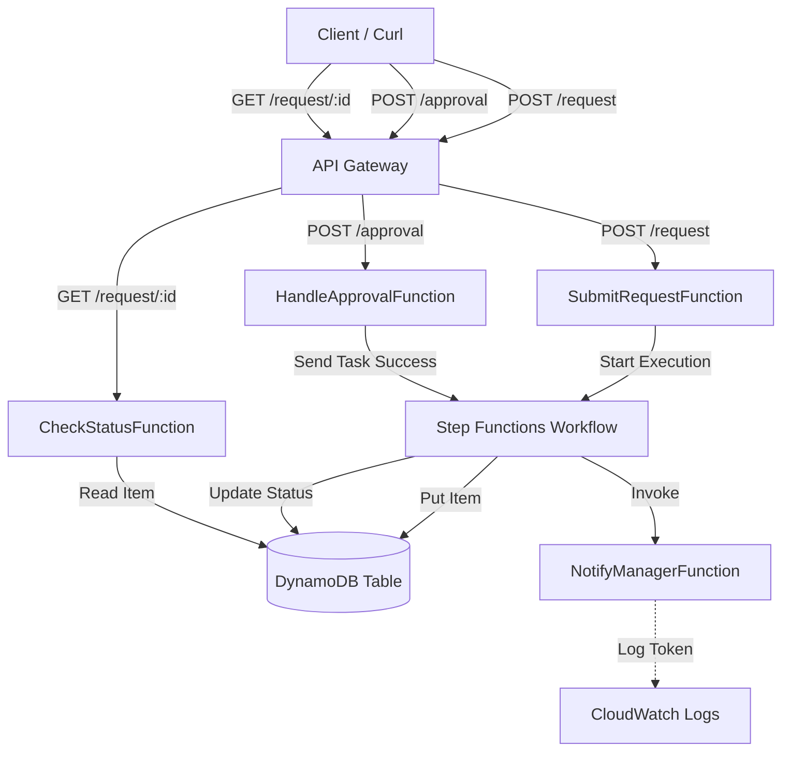
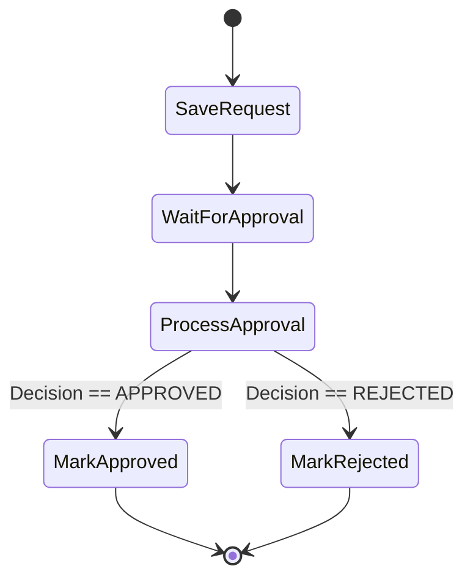

# Serverless Certification Approval System - Deep Dive

This document provides a detailed explanation of the system's architecture, code components, Step Functions workflow, and API Gateway configuration.

## 1. System Architecture Overview

The system allows users to submit certification requests, which trigger an approval workflow. A manager (simulated) approves or rejects the request, and the system updates the status accordingly.

---

## 2. Lambda Functions Deep Dive

### 2.1 Initiating the Workflow within `submit_request.py`
**Role:** entry point.
-   **Trigger:** `POST /request` via API Gateway.
-   **Logic:**
    1.  Parses the JSON body (name, course, cost).
    2.  Uses `boto3.client('stepfunctions')` to call `start_execution`.
    3.  Passes the input data to the State Machine.
-   **Key Concept:** It does *not* write to DynamoDB itself. It delegates the entire process to the State Machine to ensure the workflow is tracked from the very beginning.

### 2.2 The Manual Pause with `notify_manager.py`
**Role:** Simulates sending an approval email.
-   **Trigger:** Invoked by Step Functions during the "WaitForApproval" state.
-   **Input:** Receives a payload containing the request details AND a special `taskToken`.
-   **Logic:**
    -   In a real-world scenario, this function would send an email (SES) or Slack message containing a link with the `taskToken`.
    -   **For this demo:** It simply prints the `taskToken` to CloudWatch Logs so you can copy it manually.
-   **Key Concept**: The function finishes execution immediately, but the *Step Function* stays paused, waiting for that specific token to be returned.

### 2.3 Resuming with `handle_approval.py`
**Role:** Processes the manager's decision.
-   **Trigger:** `POST /approval` via API Gateway.
-   **Input:** JSON body with `requestId`, `decision`, and the crucial `taskToken`.
-   **Logic:**
    1.  Validates the decision (APPROVED/REJECTED).
    2.  Calls `sfn_client.send_task_success(taskToken=..., output=...)`.
-   **Key Concept**: This API call tells Step Functions: *"Hey, remember that workflow you paused? Here is the result you were waiting for. Resume execution with this data."*

### 2.4 Visibility with `check_status.py`
**Role:** Read-only status checker.
-   **Trigger:** `GET /request/{requestId}`.
-   **Logic:**
    -   Connects directly to DynamoDB.
    -   Fetches the item by `requestId`.
-   **Key Concept**: It decouples the reading logic from the workflow logic. Even if the workflow is paused or finished, the state is persisted in the database.

---

## 3. Step Functions Workflow Explained

The State Machine definition (`step-functions-definition.json`) controls the logic flow.

### Visual Workflow

### Key States

1.  **`SaveRequest` (Task - DynamoDB PutItem)**:
    -   Automatically validates inputs and writes the initial record to DynamoDB with status `PENDING`.
    -   This ensures the database is always in sync with the workflow start.

2.  **`WaitForApproval` (Task - Lambda with Callback)**:
    -   **Resource**: `arn:aws:states:::lambda:invoke.waitForTaskToken`
    -   **The Magic**: The `.waitForTaskToken` suffix tells Step Functions: *"Call the Lambda, but then PAUSE immediately. Do not move to the next step until someone calls `SendTaskSuccess` with my token."*
    -   This allows the workflow to wait for seconds, days, or even up to a year for human interaction without paying for Lambda execution time while waiting.

3.  **`ProcessApproval` (Choice)**:
    -   Acts like an `if/else` block.
    -   Checks the output received from `HandleApprovalFunction` (which called `SendTaskSuccess`).
    -   Routes to `MarkApproved` or `MarkRejected`.

4.  **`MarkApproved` / `MarkRejected` (Task - DynamoDB UpdateItem)**:
    -   Updates the item in DynamoDB with the final status.

---

## 4. HTTP API Gateway Configuration

We use **HTTP API** (a lighter, cheaper, faster version of REST API) to expose our Lambda functions to the web.

### Routes & Integrations

| Route | Method | Integration Target | Purpose |
| :--- | :--- | :--- | :--- |
| `/request` | `POST` | `SubmitRequestFunction` | User submits a new form. |
| `/approval` | `POST` | `HandleApprovalFunction` | Manager submits decision + token. |
| `/request/{requestId}` | `GET` | `CheckStatusFunction` | Anyone checks current status. |

### Configuration Mapping
-   **Integration**: Connects a specific URL path (Route) to a backend resource (Lambda).
-   **Payload Format Version**: We typically use 2.0 for HTTP APIs, which structures the `event` object received by Python in a specific way (e.g., `event['body']`, `event['pathParameters']`).

### Why we removed CORS?
Cross-Origin Resource Sharing (CORS) is a browser security feature. It restricts web pages from making requests to a different domain than the one that served the web page.
-   **Original Plan**: We intended to have an `index.html` frontend. This frontend would run in your browser (e.g., `localhost` or `s3-website`) and call the API (`amazonaws.com`). Since the domains differ, CORS headers were required.
-   **Current State**: We removed the frontend to simplify the project. You are now using `curl` (a command-line tool). CLI tools usually do not enforce CORS, so the complex configuration headers (`Access-Control-Allow-Origin`, etc.) are less critical (though technically good practice to keep generic). The API now acts as a pure headless backend service.